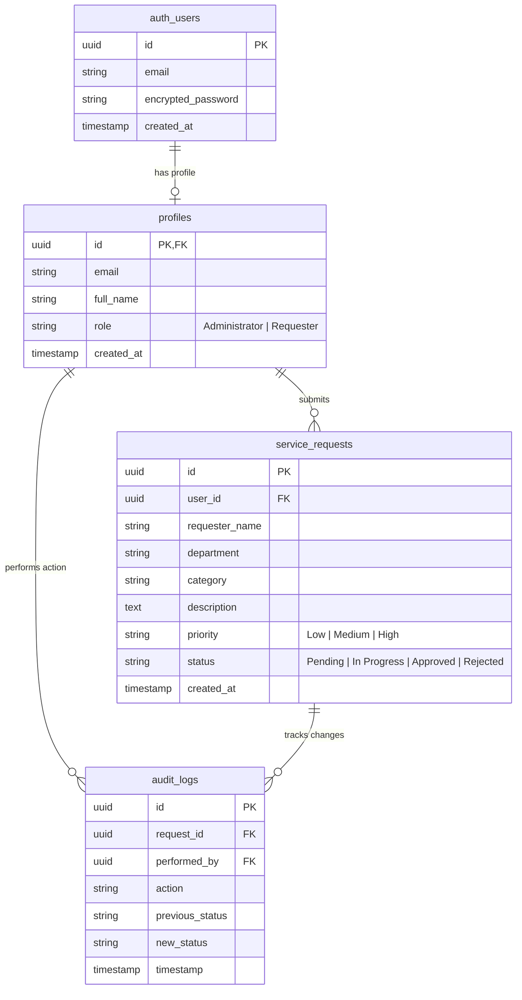
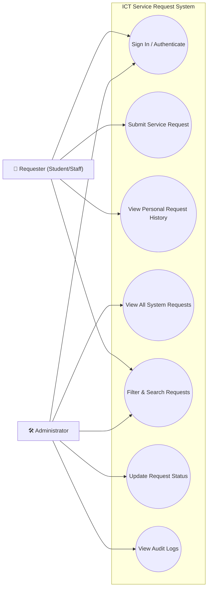
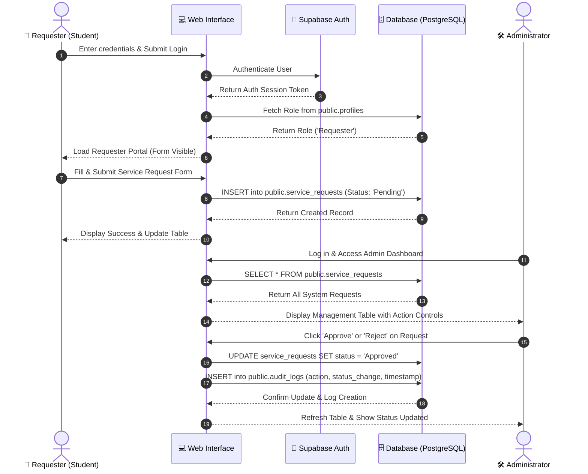

# Systems Analysis and Design — Laboratory 3 & 4
**ICT Service Request System with Role-Based Access Control & Auditing**

* **GitHub Repository URL:** [https://github.com/shanearcelo/SAD-ServiceRequest-ARCELO](https://github.com/shanearcelo/SAD-ServiceRequest-ARCELO)
* **Live GitHub Pages URL:** [https://shanearcelo.github.io/SAD-ServiceRequest-ARCELO/login.html](https://shanearcelo.github.io/SAD-ServiceRequest-ARCELO/login.html)

---

## System Overview
This project is an integrated web-based ICT Service Request System built during **Laboratory 3** and expanded in **Laboratory 4**. It allows students and staff (Requesters) to submit ICT service and hardware requests, while providing Administrators with tools to manage, approve, reject, and audit all incoming workflow activities.

### Tech Stack
* **Frontend:** HTML5, CSS3, JavaScript (ES6+ Modules)
* **Backend / Database:** Supabase (PostgreSQL, Authentication, Row-Level Security)
* **Hosting:** GitHub Pages

---

## Test Credentials
* **Administrator Account:** `admin@gmail.com` | Password: `admin123`
* **Requester Account:** `student@gmail.com` | Password: `student123`

---

## Updated ERD and Use Case Diagram

### Entity-Relationship Diagram (ERD)

### Use Case Diagram

## Role-Permission Matrix

| Functional Module / Feature | Requester | Administrator |
| :--- | :---: | :---: |
| Authenticate / Sign In | Yes | Yes |
| View Own Request History | Yes | Yes |
| Submit New Service Request | Yes | No |
| View All System Requests | No | Yes |
| Filter & Search Requests | Self-Only | All Users |
| Update Request Status (Approve/Reject) | No | Yes |
| View Audit Logs | No | Yes |

---

## Workflow Diagram

## Business Rules

1. **Authentication Rule:** Users must be authenticated via Supabase Auth to access any dashboard functionality. Unauthenticated users are redirected to `login.html`.
2. **Default Role Assignment:** New users are automatically registered as `Requester` by default unless explicitly granted `Administrator` rights in `public.profiles`.
3. **Role-Based Visibility:**
   * **Requesters** can only see submission forms and their personal request history.
   * **Administrators** cannot submit requests, but can view, filter, and manage all requests.
4. **Status Lifecycle:** A request begins with a `Pending` status. Only Administrators can transition statuses (`Pending` $\rightarrow$ `In Progress` $\rightarrow$ `Approved` / `Rejected`).
5. **Audit Logging Rule:** Any status update performed by an Administrator automatically generates an immutable record in `public.audit_logs`.

---

## Audit-Log Screenshot

> Below is the recorded audit log output capturing status transitions and timestamps:

[AUDIT LOG ENTRY]
Timestamp: 2026-09-15 12:05:11 UTC
Performed By: admin@gmail.com (ID: 11111111-1111-1111-1111-111111111111)
Action: STATUS_UPDATE
Request ID: req_982347
Status Change: Pending -> Approved

---

## Functional Test Results

| Test Case | Description | User Role | Expected Result | Result |
| :--- | :--- | :---: | :--- | :---: |
| **TC-01** | User Login | Student | Access granted to Requester Portal | **PASS** |
| **TC-02** | Submit Request | Student | Request added with status `Pending` | **PASS** |
| **TC-03** | Admin Login | Admin | Access granted to Management Dashboard | **PASS** |
| **TC-04** | Role Interface Guard | Admin | Request submission form is hidden | **PASS** |
| **TC-05** | Update Status | Admin | Status changes from `Pending` to `Approved` | **PASS** |
| **TC-06** | Audit Trail Creation | System | Automated row added to `audit_logs` | **PASS** |
| **TC-07** | Logout | All | Session cleared and redirected to `login.html` | **PASS** |

                 
